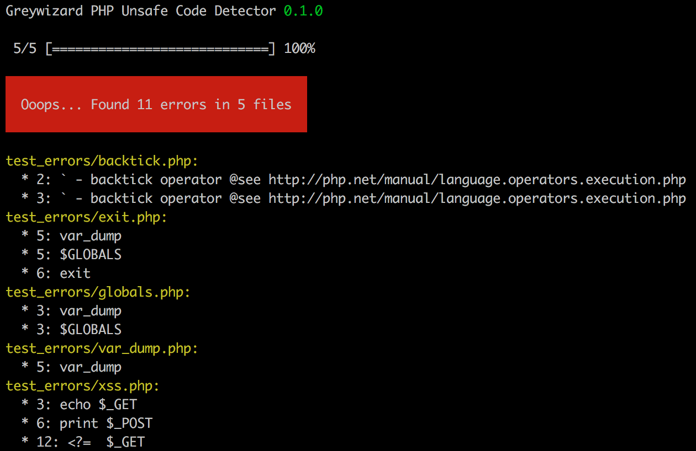

# PHP Unsafe Code Detector

## Why?

To detect unsafe places in your code.

## Usage

```bash
phpucd analyze $SOURCE_DIRECTORY
```

## Installation

Download latest version, then follow steps:

```
composer.phar update --no-dev
bin/compile
chmod +x phpucd.phar
mv phpucd.phar /usr/local/bin/phpucd
```

## Example:

Command:

```bash
phpucd analyze test_errors
```

Output:



## Versioning


The version numbers follow the [Semantic Versioning 2.0.0](http://semver.org/) scheme.

## Requirements

* PHP ^5.5.9
* [Composer.phar](https://getcomposer.org/) (required only during installation)
